# Phase 2: Architecture Design

## Proposals Considered

### Proposal A: "Gateway Heart" — Plugin Architecture
A plugin-capable gateway where adapters are dynamically loaded plugins with a strict contract. An OpenAPI spec serves as the single source of truth — MCP tools, REST endpoints, and client SDKs all derived from it. Maximum extensibility, but high initial complexity and plugin API stability burden. Deferred: plugin system could be adopted in v2+ when third-party adapter support becomes a priority.

### Proposal B: "Lean Heart" — Developer Experience & Simplicity ✅ Selected
Minimal, handcrafted heart. Adapters are regular TypeScript modules in a monorepo. Clean hexagonal architecture with explicit port interfaces. MCP and REST both built directly on the domain layer. Readable, debuggable, fast to build.

### Proposal C: "Resilient Heart" — Offline & Independence
Cache-through reads, operation queue for writes, CLI local cache. Every component works when others are down. Maximum resilience, but high complexity from sync engine, conflict detection, and multiple cache layers. Deferred: caching and offline capabilities could be layered onto the Lean Heart in v2+.

## Comparison

| Aspect | A: Gateway Heart | B: Lean Heart | C: Resilient Heart |
|---|---|---|---|
| **Core pattern** | Plugin gateway + OpenAPI-first | Monorepo + handcrafted API | Cache-through + operation queue |
| **Extensibility** | ⭐⭐⭐⭐⭐ | ⭐⭐⭐⭐ | ⭐⭐⭐ |
| **Developer friendliness** | ⭐⭐⭐ | ⭐⭐⭐⭐⭐ | ⭐⭐⭐ |
| **Offline/resilience** | ⭐⭐ | ⭐⭐ | ⭐⭐⭐⭐⭐ |
| **Time to MVP** | Slow | Fast | Slow |
| **Codebase complexity** | High | Low-Medium | High |
| **Clean architecture** | ✅ | ✅ (purest) | ✅ (with added layers) |

## Selected Architecture: Lean Heart (Proposal B)

### Rationale
- **Clean architecture in its purest form** — hexagonal/ports & adapters without extra layers (plugins, caches, queues)
- **Developer friendly** — the entire codebase can be read and understood quickly. No dynamic loading, no generated code in the critical path
- **Fastest path to MVP** — build what you need, nothing more
- **Clear upgrade path** — plugin system (A) and caching layer (C) can be added later without architectural rewrites; they are additive, not structural changes
- **Best fit for team size** — works for a solo developer and scales to a team

### Language Evaluation Summary

The heart language was evaluated across TypeScript, Go, Python, Kotlin, and Rust. The real contenders were TypeScript and Go.

| Criteria | TypeScript | Go |
|---|---|---|
| MCP SDK maturity | Most mature, features first | v1.3.0 stable, slight lag |
| Hexagonal architecture | Good (interfaces + Zod) | Excellent (implicit interfaces) |
| GitHub/JIRA client libs | Octokit, jira.js (excellent) | go-github, go-jira (decent) |
| Deployment | Needs runtime (Node/Bun) | Single binary |
| MCP community/examples | Dominant | Growing |
| Developer pool | Larger | Smaller |

**TypeScript selected for the heart** because:
1. Adapters are the heart's core job — Octokit and jira.js are significantly better than Go equivalents
2. MCP SDK features land in TypeScript first — critical for a product whose value is MCP integration
3. Largest MCP ecosystem with the most patterns, examples, and middleware to reference

### Language Map

| Component | Language | Rationale |
|---|---|---|
| **Heart** (core + adapters + MCP + API) | TypeScript | Best MCP SDK, best adapter libraries, strong types |
| **CLI** | Go | Native binary, Cobra + Bubbletea, excellent terminal UX |
| **Lightweight Tracker** | Python | FastAPI + SQLite, rapid development, clear scope |

### Component Diagram

```mermaid
graph TB
    subgraph Consumers["Entry Points (Consumers)"]
        LLM["LLM<br/>(Claude Code, etc.)"]
        CLIMAIN["Go CLI<br/>(Developer Tool)"]
        EXTAPP["External Apps"]
    end

    subgraph Heart["Meridian Heart — TypeScript Monorepo"]
        direction TB

        subgraph Inbound["Inbound Adapters (Driving)"]
            MCP["MCP Server<br/>@modelcontextprotocol/sdk<br/>(role-based tool filtering via tags)"]
            REST["REST API<br/>Hono + Zod<br/>(OpenAPI auto-generated)"]
        end

        subgraph Domain["Domain Layer (Pure TypeScript)"]
            UC["Use Cases<br/>(create-issue, assign-task,<br/>update-status, view-roadmap, ...)"]
            MODEL["Domain Model<br/>(Issue, Epic, Sprint, Comment,<br/>User, Project, Status, ...)"]
            PORTS["Port Interfaces<br/>(IIssueRepository,<br/>IProjectRepository, ...)"]
        end

        subgraph Outbound["Outbound Adapters (Driven)"]
            GH["GitHub Adapter<br/>(Octokit)"]
            JR["JIRA Adapter<br/>(jira.js)"]
            LT["Local Tracker Adapter<br/>(HTTP client)"]
        end

        subgraph Infra["Infrastructure"]
            AUTH["Auth Delegation<br/>(per-adapter credentials)"]
            AUDIT["Audit Logger"]
            CONFIG["Config Manager<br/>(active adapter selection)"]
        end
    end

    subgraph Tracker["Meridian Tracker — Python"]
        TAPI["FastAPI<br/>(REST API)"]
        TCORE["Tracker Domain<br/>(issues, projects)"]
        TDB["Storage<br/>(SQLite or Flat Files)"]
    end

    subgraph External["External Systems"]
        GHAPI["GitHub API"]
        JRAPI["JIRA Cloud API"]
    end

    LLM -->|"MCP Protocol<br/>(stdio / streamable HTTP)"| MCP
    CLIMAIN -->|"HTTP/REST"| REST
    EXTAPP -->|"HTTP/REST"| REST

    MCP --> UC
    REST --> UC
    UC --> PORTS
    UC --> AUDIT

    PORTS -.->|implements| GH
    PORTS -.->|implements| JR
    PORTS -.->|implements| LT

    GH -->|"REST API"| GHAPI
    JR -->|"REST API"| JRAPI
    LT -->|"REST API"| TAPI

    TAPI --> TCORE
    TCORE --> TDB

    CONFIG -.->|selects active| Outbound
    AUTH -.->|provides credentials| Outbound
```



### Component Overview

| Component | Technology | Responsibility | Communication |
|---|---|---|---|
| **MCP Server** | `@modelcontextprotocol/sdk`, TypeScript | Role-filtered MCP tool exposure for LLMs | MCP protocol (stdio for local, streamable HTTP for remote) |
| **REST API** | Hono + Zod + `@hono/zod-openapi` | Unified Issue Tracking API for CLI and external consumers | HTTP/REST with auto-generated OpenAPI spec |
| **Domain Layer** | Pure TypeScript (no framework) | Use cases, domain model, port interfaces | Internal function calls (library, not service) |
| **GitHub Adapter** | Octokit (TypeScript) | Translate unified operations → GitHub Issues API | HTTPS to api.github.com |
| **JIRA Adapter** | jira.js (TypeScript) | Translate unified operations → JIRA Cloud API | HTTPS to *.atlassian.net |
| **Local Tracker Adapter** | HTTP client (fetch/undici) | Translate unified operations → Meridian Tracker API | HTTP to localhost / configurable URL |
| **Audit Logger** | TypeScript, structured JSON logging | Record all operations for compliance | Writes to configurable sink (file, stdout) |
| **Config Manager** | TypeScript, env/YAML | Select active adapter, manage credentials | Read at startup, runtime switchable |
| **Meridian CLI** | Cobra + Bubbletea + generated OpenAPI client | Developer UX: project overview, task management | HTTP/REST to Heart API |
| **Meridian Tracker** | Python FastAPI + SQLite/flat files | Standalone issue tracking for local/small-team use | HTTP/REST (consumed by Heart's adapter) |

### Data Flow

#### 1. LLM Creates an Issue via MCP

```
LLM (Claude Code)
  → MCP Client sends `tools/call` with tool="create-issue"
    → Heart MCP Server receives call, checks role tag authorization
      → MCP Server translates to CreateIssueUseCase(input)
        → Use Case validates via domain model
          → Use Case calls IIssueRepository.create(issue)
            → Active adapter (e.g., GitHub Adapter) translates to Octokit call
              → GitHub API creates issue, returns ID
            ← Adapter maps GitHub response → domain Issue
          ← Use Case returns domain Issue
        ← Audit Logger records operation
      ← MCP Server formats MCP response
    ← MCP Client receives result
  ← LLM gets structured confirmation
```

#### 2. Developer Views Project Overview via CLI

```
Developer runs `meridian overview`
  → Go CLI calls GET /api/v1/projects/:id/overview
    → Heart REST API validates request (Zod)
      → GetProjectOverviewUseCase executes
        → Calls IProjectRepository.getOverview()
          → Active adapter fetches from GitHub (milestones, issues, labels)
        → Calls IIssueRepository.list(filters)
          → Active adapter fetches filtered issues
        ← Use Case aggregates into ProjectOverview domain object
      ← REST API serializes to JSON
    ← CLI receives JSON
  ← CLI renders with Bubbletea TUI (tables, colors, status indicators)
```

#### 3. External App Queries Issues via REST

```
External App (webhook, automation, dashboard)
  → HTTP GET /api/v1/issues?status=open&assignee=me
    → Heart REST API validates query params (Zod)
      → ListIssuesUseCase executes with filters
        → IIssueRepository.list(filters)
          → Active adapter queries backend
        ← Returns domain Issue[]
      ← Audit Logger records read operation
    ← REST API returns JSON array
  ← External app processes response
```

#### 4. Heart Connects to Meridian Tracker

```
(Any consumer: LLM, CLI, or External App)
  → Request flows through Heart as above
    → Use Case calls port interface
      → Local Tracker Adapter translates to HTTP call
        → GET/POST/PATCH to Meridian Tracker's FastAPI
          → Tracker processes independently (own domain, own DB)
          ← Returns tracker-native response
        ← Adapter maps response → unified domain model
      ← Use Case returns domain object
    ← Response flows back through MCP or REST
```

### Key Design Decisions

#### 1. Single Heart Service with Dual Protocol (MCP + REST)
- **Decision:** One service process exposes both MCP and REST API, sharing the domain layer
- **Rationale:** Both protocols are just inbound adapters over the same use cases. No duplication of business logic. Single deployment unit.
- **Alternatives rejected:** Separate MCP and REST services (unnecessary complexity, would need shared DB or IPC for domain state)

#### 2. Adapters Are Static Modules, Not Dynamic Plugins
- **Decision:** Adapters are TypeScript packages in the monorepo, selected at startup via configuration
- **Rationale:** Type-safe, debuggable, no runtime surprises. Adding a new adapter means adding a package and implementing the port interface. The monorepo ensures everything compiles together.
- **Alternatives rejected:** Dynamic plugin loading (adds complexity without benefit at current scale; can be added in v2+ when third-party adapters become relevant)

#### 3. Role-Based MCP Tool Filtering via Tags
- **Decision:** Each MCP tool is tagged with roles (e.g., `pm`, `dev`, `qa`). Clients connect with tag filters (e.g., `?include_tags=pm`) to receive only relevant tools.
- **Rationale:** Proven pattern (Xweather MCP server). Keeps LLM context focused. Avoids tool overload. Single server, multiple "views."
- **Alternatives rejected:** Multiple MCP server instances (operational overhead, code duplication). Dynamic per-user filtering (too complex for v1).

#### 4. Go CLI Consumes REST API (Not MCP)
- **Decision:** The CLI is a REST API client, not an MCP client
- **Rationale:** REST is simpler for programmatic clients. The CLI doesn't need MCP protocol overhead — it knows exactly what tools/endpoints exist. Generated OpenAPI client gives type safety. The CLI is for humans using the terminal, not for LLMs.
- **Alternatives rejected:** CLI as MCP client (unnecessary protocol overhead, MCP designed for LLM-to-tool communication)

#### 5. Meridian Tracker Is Fully Independent
- **Decision:** The tracker has its own domain model, own storage, own API. The heart connects to it via an adapter like any other backend.
- **Rationale:** The tracker should work without the heart. A solo developer could use just the tracker + its API. The heart treats it as "just another backend" — clean decoupling.
- **Alternatives rejected:** Tracker as a library inside the heart (would couple them), tracker without its own API (would make it useless standalone)

#### 6. OpenAPI Spec Generated From Code
- **Decision:** The REST API code (Hono + Zod schemas) is the source of truth. OpenAPI spec is auto-generated from it.
- **Rationale:** API always matches implementation. No spec drift. The generated spec drives Go CLI client generation and documentation.
- **Alternatives rejected:** Spec-first (adds maintenance burden of keeping spec and code in sync; for a monorepo team, code-first is faster)

### Monorepo Structure

```
meridian/
├── packages/
│   ├── core/                    # Domain Layer
│   │   ├── src/
│   │   │   ├── model/           # Domain entities (Issue, Epic, Project, ...)
│   │   │   ├── ports/           # Port interfaces (IIssueRepository, ...)
│   │   │   ├── use-cases/       # Application use cases
│   │   │   └── errors/          # Domain-specific errors
│   │   ├── package.json
│   │   └── tsconfig.json
│   │
│   ├── adapter-github/          # GitHub Issues Adapter
│   │   ├── src/
│   │   │   ├── github-issue-repository.ts
│   │   │   ├── github-project-repository.ts
│   │   │   └── mappers/         # GitHub ↔ Domain mappers
│   │   └── package.json
│   │
│   ├── adapter-jira/            # JIRA Adapter (v2)
│   │   └── ...
│   │
│   ├── adapter-local/           # Local Tracker Adapter
│   │   ├── src/
│   │   │   ├── local-issue-repository.ts
│   │   │   └── mappers/         # Tracker API ↔ Domain mappers
│   │   └── package.json
│   │
│   ├── mcp-server/              # MCP Inbound Adapter
│   │   ├── src/
│   │   │   ├── server.ts        # MCP server setup
│   │   │   ├── tools/           # Tool definitions grouped by role
│   │   │   │   ├── pm/          # PM tools (create-epic, view-roadmap, ...)
│   │   │   │   ├── dev/         # Dev tools (pick-task, update-status, ...)
│   │   │   │   └── shared/      # Tools available to all roles
│   │   │   └── role-filter.ts   # Tag-based tool filtering logic
│   │   └── package.json
│   │
│   ├── rest-api/                # REST Inbound Adapter
│   │   ├── src/
│   │   │   ├── app.ts           # Hono app setup
│   │   │   ├── routes/          # Route definitions with Zod schemas
│   │   │   │   ├── issues.ts
│   │   │   │   ├── projects.ts
│   │   │   │   └── health.ts
│   │   │   └── middleware/      # Auth, audit, error handling
│   │   └── package.json
│   │
│   ├── heart/                   # Composition Root
│   │   ├── src/
│   │   │   ├── main.ts          # Wire everything together, start servers
│   │   │   ├── config.ts        # Load config, select adapter
│   │   │   └── container.ts     # Dependency injection / wiring
│   │   └── package.json
│   │
│   └── shared/                  # Shared utilities
│       ├── src/
│       │   ├── logger.ts        # Structured audit logging
│       │   ├── types.ts         # Shared type utilities
│       │   └── errors.ts        # Common error types
│       └── package.json
│
├── cli/                         # Go CLI (separate module)
│   ├── cmd/                     # Cobra commands
│   │   ├── root.go
│   │   ├── overview.go
│   │   ├── issues.go
│   │   └── config.go
│   ├── internal/
│   │   ├── api/                 # Generated OpenAPI client
│   │   ├── tui/                 # Bubbletea components
│   │   └── config/              # CLI configuration
│   ├── go.mod
│   └── go.sum
│
├── tracker/                     # Python Meridian Tracker (separate)
│   ├── src/
│   │   ├── main.py              # FastAPI app
│   │   ├── domain/              # Tracker's own domain model
│   │   ├── storage/             # SQLite + flat file backends
│   │   ├── routes/              # API endpoints
│   │   └── config.py
│   ├── pyproject.toml
│   └── tests/
│
├── planning/                    # Architecture documents (this)
├── turbo.json                   # Monorepo build orchestration
├── package.json                 # Root workspace
└── README.md
```

### Trade-offs

| Aspect | Benefit | Cost |
|---|---|---|
| TypeScript for heart | Best MCP SDK, best adapter libs, strong types | Runtime dependency (Node/Bun), larger deployment than Go |
| Polyglot (TS + Go + Python) | Best-fit language per component | Three build systems, three test frameworks, broader skill requirements |
| Single heart process | Simple deployment, shared domain, no IPC | Must scale entire heart together (fine for expected load) |
| Adapters as static modules | Type-safe, debuggable, compile-time checks | New adapters require monorepo contribution (mitigated by v2+ plugin system) |
| REST API for CLI (not MCP) | Simpler, faster, type-safe generated client | CLI doesn't benefit from MCP protocol features (not needed) |
| Tracker fully independent | Works standalone, clean decoupling | Adapter must translate between two domain models |
| Code-first OpenAPI | No spec drift, API always matches | Spec is build artifact, not contract-first |

### V2+ Architecture Evolution Path

The Lean Heart is designed to evolve without rewrites:

| Future Capability | How It Fits |
|---|---|
| **Plugin system (from Proposal A)** | Port interfaces already define the plugin contract. Add a plugin loader that dynamically imports adapters implementing the same interfaces. |
| **Caching layer (from Proposal C)** | Add a caching decorator around the port interfaces (Decorator pattern). Transparent to use cases. |
| **Offline CLI (from Proposal C)** | Add SQLite cache in Go CLI that stores recent API responses. Fallback to cache when heart is unreachable. |
| **Multi-backend support** | Config selects multiple adapters. Use Case routes operations to the correct adapter per project. Domain model gains `source` field. |
| **MCP Gateway pattern** | Heart already exposes MCP. Wrap it with an MCP Gateway (authentication, rate limiting, multi-tenant routing) in front. |
| **Web UI for tracker** | Tracker already has a REST API. Add a React/Vue frontend that consumes it. |

### Sources

1. [MCP TypeScript SDK — GitHub](https://github.com/modelcontextprotocol/typescript-sdk)
2. [MCP Go SDK — GitHub](https://github.com/modelcontextprotocol/go-sdk)
3. [MCP Best Practices: Architecture & Implementation Guide](https://modelcontextprotocol.info/docs/best-practices/)
4. [MCP Tool Filtering & Scoping — Xweather](https://www.xweather.com/docs/mcp-server/filtering-tool-scoping)
5. [MCP Gateway Architecture — acehoss/mcp-gateway](https://github.com/acehoss/mcp-gateway)
6. [Hexagonal Architecture with TypeScript — Better Programming](https://betterprogramming.pub/how-to-ports-and-adapter-with-typescript-32a50a0fc9eb)
7. [Go Hexagonal Architecture — GitHub Topics](https://github.com/topics/hexagonal-architecture?l=go)
8. [Apideck Unified Issue Tracking API](https://www.apideck.com/issue-tracking-api)
9. [FastMCP 3.0 — Production-Ready MCP Servers](https://www.jlowin.dev/blog/fastmcp-3)
10. [Cobra CLI — GitHub](https://github.com/spf13/cobra)
11. [API Gateway Pattern — Microservices.io](https://microservices.io/patterns/apigateway.html)
12. [MCP Server vs MCP Gateway Comparison 2025](https://skywork.ai/blog/mcp-server-vs-mcp-gateway-comparison-2025/)
13. [OpenAPI Generator — GitHub](https://github.com/OpenAPITools/openapi-generator)
14. [FastAPI + SQLite Databases — GeeksforGeeks](https://www.geeksforgeeks.org/python/fastapi-sqlite-databases/)
