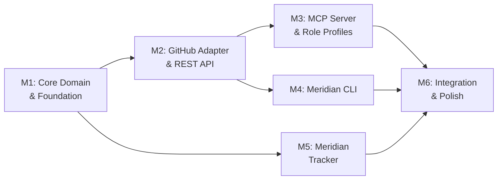

# Phase 4: Implementation Roadmap

## Milestones

Milestones are ordered to de-risk the hardest unknowns first: the domain model and port interface design (Milestone 1), then the first adapter integration (Milestone 2), then the MCP layer that ties it all together (Milestone 3).

---

### Milestone 1: Core Domain & Foundation
**Deliverable:** The domain model, port interfaces, and monorepo scaffold — the skeleton that everything else builds on. No adapters yet, but the contracts are defined and tested with in-memory fakes.

**Tasks:**
- [ ] Initialize monorepo structure (pnpm + Turborepo + TypeScript) — **S**
- [ ] Set up shared dev tooling (ESLint, Prettier, Vitest, tsconfig base) — **S**
- [ ] Design domain model entities (Issue, Epic, Project, Comment, User, Status, Priority, Tag) — **L**
- [ ] Define port interfaces (IIssueRepository, IProjectRepository, ICommentRepository, IUserRepository) — **L**
- [ ] Implement domain use cases with in-memory adapters (CreateIssue, UpdateIssue, ListIssues, GetProjectOverview, AssignIssue, UpdateStatus) — **L**
- [ ] Set up Pino-based audit logger (shared package) — **S**
- [ ] Write comprehensive tests for domain model and use cases using in-memory adapters — **M**
- [ ] Set up CI pipeline (lint, type-check, test) — **S**

**Dependencies:** None (this is the foundation)

**Risks:**
- **Domain model gets it wrong:** The abstraction may not fit all backends well. *Mitigation:* Study Apideck's proven unified model, design with extension points (`metadata` field for backend-specific data), and validate against GitHub Issues and JIRA data models before finalizing.
- **Over-engineering ports:** Defining too many interfaces too early. *Mitigation:* Start with the minimum set of ports needed for the first use cases. Add ports as needed, not speculatively.

**Exit Criteria:** `turbo test` passes. All use cases work with in-memory adapters. Domain model is documented.

---

### Milestone 2: GitHub Adapter & REST API
**Deliverable:** The heart can read/write GitHub Issues through the REST API. A developer can `curl` the API to create, list, and update issues on a real GitHub repo.

**Tasks:**
- [ ] Implement GitHub adapter (IIssueRepository → Octokit calls) — **L**
- [ ] Implement GitHub mapper (GitHub API response ↔ domain model translation) — **M**
- [ ] Implement GitHub project adapter (IProjectRepository → GitHub Projects/Milestones) — **M**
- [ ] Set up Hono REST API with @hono/zod-openapi — **M**
- [ ] Define REST routes: `POST /api/v1/issues`, `GET /api/v1/issues`, `GET /api/v1/issues/:id`, `PATCH /api/v1/issues/:id`, `GET /api/v1/projects/:id/overview` — **M**
- [ ] Implement composition root (heart package: wire domain + adapter + API) — **M**
- [ ] Implement config manager (adapter selection, GitHub credentials via env) — **S**
- [ ] Set up auth delegation for GitHub (PAT / OAuth token passthrough) — **S**
- [ ] Auto-generate OpenAPI spec from Hono routes — **S**
- [ ] Write integration tests against GitHub API (test repo) — **M**
- [ ] Write API endpoint tests (in-memory adapter for fast tests) — **M**

**Dependencies:** Milestone 1 (domain model and ports)

**Risks:**
- **GitHub API rate limiting:** Integration tests may hit rate limits. *Mitigation:* Use a dedicated test repo, mock GitHub API responses for unit tests, only hit real API in CI integration test stage.
- **Domain model mismatch:** GitHub's data model may not map cleanly to the unified model. *Mitigation:* The mapper layer handles all translation. Use the `metadata` extension field for GitHub-specific data (labels, reactions, etc.) that don't have a unified equivalent.

**Exit Criteria:** Can create an issue on a real GitHub repo via `curl POST /api/v1/issues`, list issues via `GET /api/v1/issues`, and update status via `PATCH /api/v1/issues/:id`. OpenAPI spec is auto-generated and accurate.

---

### Milestone 3: MCP Server & Role Profiles
**Deliverable:** LLMs can interact with GitHub Issues through the MCP server. Two role profiles (PM and Dev) expose different tool sets.

**Tasks:**
- [ ] Set up MCP server using @modelcontextprotocol/sdk — **M**
- [ ] Define PM role tools: `create-epic`, `view-roadmap`, `assign-priority`, `list-milestones`, `project-overview` — **L**
- [ ] Define Dev role tools: `pick-next-task`, `update-status`, `view-issue-detail`, `list-my-issues`, `add-comment` — **L**
- [ ] Define shared tools: `search-issues`, `get-issue`, `list-projects` — **M**
- [ ] Implement tag-based role filtering (include_tags/exclude_tags query params) — **M**
- [ ] Wire MCP tools to domain use cases (thin translation layer) — **M**
- [ ] Support stdio transport (for Claude Code local usage) — **S**
- [ ] Support streamable HTTP transport (for remote/shared usage) — **M**
- [ ] Add MCP server to composition root (heart starts both MCP + REST) — **S**
- [ ] Write MCP integration tests (mock client → tool calls → verify results) — **M**
- [ ] Test with Claude Code as real MCP client — **M**
- [ ] Document MCP server configuration and role profiles — **S**

**Dependencies:** Milestone 2 (REST API and GitHub adapter working)

**Risks:**
- **Tool design for LLMs:** Tools that seem logical to humans may confuse LLMs. *Mitigation:* Write clear tool descriptions, test with Claude Code early, iterate on tool naming and parameter design based on actual LLM usage.
- **Role filtering edge cases:** Filtering logic may have precedence bugs. *Mitigation:* Follow the proven Xweather pattern (exclude > include precedence), write comprehensive filter tests.

**Exit Criteria:** Claude Code can connect to the MCP server, see only PM or Dev tools (depending on config), and successfully create/list/update GitHub Issues. Both stdio and HTTP transports work.

---

### Milestone 4: Meridian CLI (Go)
**Deliverable:** Developers can use the `meridian` CLI to view project overview, list/create/update issues, and manage tasks from the terminal.

**Tasks:**
- [ ] Generate Go API client from Heart's OpenAPI spec (oapi-codegen) — **S**
- [ ] Set up Cobra command structure (root, overview, issues, config) — **M**
- [ ] Implement `meridian overview` — project summary with Bubbletea TUI — **M**
- [ ] Implement `meridian issues list` — filterable issue listing with table view — **M**
- [ ] Implement `meridian issues create` — interactive issue creation — **M**
- [ ] Implement `meridian issues update` — status/assignment updates — **S**
- [ ] Implement `meridian config` — heart URL, default project, preferences — **S**
- [ ] Add Lipgloss styling (colors, borders, status indicators) — **S**
- [ ] Implement output format options (table, JSON, plain text) — **S**
- [ ] Write CLI tests — **M**
- [ ] Cross-compile binaries (Linux, macOS, Windows) — **S**
- [ ] Document CLI usage and commands — **S**

**Dependencies:** Milestone 2 (REST API must be running for CLI to connect)

**Risks:**
- **OpenAPI client generation issues:** Generated code may need manual tweaks. *Mitigation:* Use oapi-codegen which produces idiomatic Go. Wrap generated client in a thin service layer so generated code can be regenerated without losing customizations.
- **UX iteration:** Terminal UX needs real-world feedback. *Mitigation:* Ship a basic version first, iterate based on own team usage.

**Exit Criteria:** `meridian overview` shows a project summary. `meridian issues list` shows issues. `meridian issues create` creates an issue on GitHub via the Heart. Cross-platform binaries build.

---

### Milestone 5: Meridian Tracker (Python)
**Deliverable:** A standalone Python issue tracker with REST API and SQLite storage, plus the Heart adapter that connects to it.

**Tasks:**
- [ ] Set up FastAPI project structure with SQLModel — **S**
- [ ] Design tracker's own domain model (Issue, Project, Comment, User, Tag) — **M**
- [ ] Implement SQLite storage backend — **M**
- [ ] Implement flat file storage backend (JSON) as alternative — **M**
- [ ] Implement REST API routes: issues CRUD, projects CRUD, comments — **M**
- [ ] Auto-generate Tracker's OpenAPI spec (FastAPI built-in) — **S**
- [ ] Implement Tracker adapter in Heart (packages/adapter-local) — **M**
- [ ] Implement mapper (Tracker API response ↔ Heart domain model) — **M**
- [ ] Write Tracker API tests — **M**
- [ ] Write adapter integration tests — **M**
- [ ] Document Tracker setup and API — **S**

**Dependencies:** Milestone 1 (port interfaces defined). Can be started in parallel with Milestone 3/4.

**Risks:**
- **Scope creep:** The tracker could grow into a full project management tool. *Mitigation:* Keep it simple: CRUD operations, no workflows, no notifications, no permissions. It's a storage backend, not a product (yet).
- **Two domain models:** The tracker has its own domain model separate from the Heart's. The mapper must translate between them. *Mitigation:* Keep the tracker model simple and close to the Heart's unified model to minimize mapping complexity.

**Exit Criteria:** Tracker runs standalone with `uvicorn`. CRUD operations work via REST API. Heart can create/list/update issues on the tracker via the adapter. Both SQLite and flat file storage work.

---

### Milestone 6: Integration, Docs & Polish
**Deliverable:** All components work together end-to-end. Documentation is complete. The system is ready for team adoption.

**Tasks:**
- [ ] End-to-end testing: LLM → MCP → Heart → GitHub (full flow) — **M**
- [ ] End-to-end testing: CLI → Heart → GitHub (full flow) — **M**
- [ ] End-to-end testing: MCP → Heart → Meridian Tracker (full flow) — **M**
- [ ] Adapter switching: configure Heart to use GitHub vs Meridian Tracker — **S**
- [ ] Audit log review: verify all operations are logged correctly — **S**
- [ ] Error handling audit: ensure clean error messages propagate through all layers — **M**
- [ ] Write README with quickstart guide — **M**
- [ ] Write architecture documentation (from planning docs → developer docs) — **M**
- [ ] Write MCP server usage guide (how to connect from Claude Code) — **S**
- [ ] Write CLI installation and usage guide — **S**
- [ ] Write adapter development guide (how to add a new backend) — **M**
- [ ] Set up GitHub releases (Heart Docker image or npm, CLI binaries, Tracker pip package) — **M**
- [ ] Performance baseline: measure API response times under typical load — **S**

**Dependencies:** Milestones 1-5 complete

**Risks:**
- **Integration bugs:** Components that work individually may fail together. *Mitigation:* Start integration testing early (from Milestone 3 onward), don't save it all for the end.
- **Documentation gaps:** Under pressure, docs get skipped. *Mitigation:* Docs are explicit tasks in each milestone, not just this one.

**Exit Criteria:** All end-to-end tests pass. Documentation covers setup, usage, and adapter development. Team can install and use the system from the docs alone.

---

## Milestone Dependency Graph



**Parallelization opportunity:** Milestones 4 (CLI) and 5 (Tracker) can be developed in parallel once their dependencies are met. Milestone 3 (MCP) and Milestone 4 (CLI) can also overlap since they depend on the same REST API.

---

## Testing Strategy

### Layers

| Layer | Scope | Tool | Target |
|---|---|---|---|
| **Unit tests** | Domain model, use cases, mappers | Vitest (TS), Go stdlib (Go), pytest (Python) | 90%+ coverage on domain layer |
| **Integration tests** | Adapter ↔ external API, API routes | Vitest + MSW for HTTP mocking | All adapters tested with real & mock backends |
| **E2E tests** | Full flow: consumer → heart → backend | Vitest + real GitHub test repo | Critical paths: create, list, update, filter |
| **MCP protocol tests** | MCP client → server tool calls | MCP SDK test client | All tools callable, role filtering works |
| **CLI tests** | Command execution and output | Go testing + golden files | All commands produce correct output |

### Testing Principles

- **In-memory adapters are the primary test backbone.** All use cases are tested against in-memory fakes first. This is fast and reliable.
- **Integration tests use real APIs sparingly.** Run against real GitHub API only in CI, with a dedicated test repo. Local development uses mocks.
- **MCP tools are tested as functions,** not just through the protocol. Each tool handler is a testable unit that receives input and returns output.
- **Golden file testing for CLI.** Expected CLI output is stored as files. Tests compare actual output against golden files. Easy to update when output format changes.

---

## CI/CD Pipeline

### Pipeline Stages

```
┌─────────────┐     ┌──────────────┐     ┌──────────────┐     ┌────────────┐
│   Lint &     │     │    Unit      │     │ Integration  │     │  Release   │
│  Type Check  │ ──► │   Tests      │ ──► │   Tests      │ ──► │  (tagged)  │
└─────────────┘     └──────────────┘     └──────────────┘     └────────────┘
```

### Stage Details

| Stage | Runs | Tools | Trigger |
|---|---|---|---|
| **Lint & Type Check** | ESLint, Prettier, tsc --noEmit, golangci-lint, ruff | Turborepo, Go, Python | Every push |
| **Unit Tests** | All unit tests (TS, Go, Python) | Vitest, go test, pytest | Every push |
| **Integration Tests** | Adapter integration tests (mocked + real GitHub) | Vitest + test repo PAT | PR to main |
| **Release** | Build artifacts, publish | Turborepo, goreleaser, uv build | Git tag |

### Artifacts

| Component | Artifact | Distribution |
|---|---|---|
| Heart | Docker image + npm packages | Docker Hub / GitHub Container Registry |
| CLI | Cross-platform binaries (linux/mac/windows, amd64/arm64) | GitHub Releases via goreleaser |
| Tracker | Python package | PyPI or GitHub Releases |

---

## Development Workflow

### Branching Strategy

- **main** — always deployable, protected
- **feat/xxx** — feature branches, one per milestone task
- **fix/xxx** — bugfix branches

### PR Process

1. Branch from `main`
2. Develop with local tests (`turbo test`, `go test`, `pytest`)
3. Push → CI runs lint + unit tests
4. Open PR → CI runs integration tests
5. Review (at least one reviewer for architectural changes)
6. Squash merge to `main`

### Local Development Setup

```bash
# Clone
git clone https://github.com/meridian-pm/meridian.git
cd meridian

# Heart (TypeScript)
pnpm install
turbo build
turbo test

# CLI (Go)
cd cli
go build -o meridian ./cmd/meridian
./meridian --help

# Tracker (Python)
cd tracker
uv sync
uv run pytest
uv run uvicorn src.main:app --reload
```

### Environment Configuration

```bash
# Heart configuration (.env)
MERIDIAN_ADAPTER=github          # github | local | jira
GITHUB_TOKEN=ghp_xxxxx          # GitHub PAT or OAuth token
GITHUB_OWNER=myorg               # GitHub org or user
GITHUB_REPO=myproject            # Target repository
HEART_PORT=3000                  # REST API port
MCP_TRANSPORT=stdio              # stdio | http
MCP_HTTP_PORT=3001               # MCP HTTP port (if transport=http)
LOG_LEVEL=info                   # debug | info | warn | error
AUDIT_LOG_PATH=./audit.log       # Audit log file path

# Tracker configuration (.env)
TRACKER_STORAGE=sqlite           # sqlite | flatfile
TRACKER_DB_PATH=./tracker.db     # SQLite database path
TRACKER_FILES_PATH=./data        # Flat file storage directory
TRACKER_PORT=3002                # Tracker API port
```
