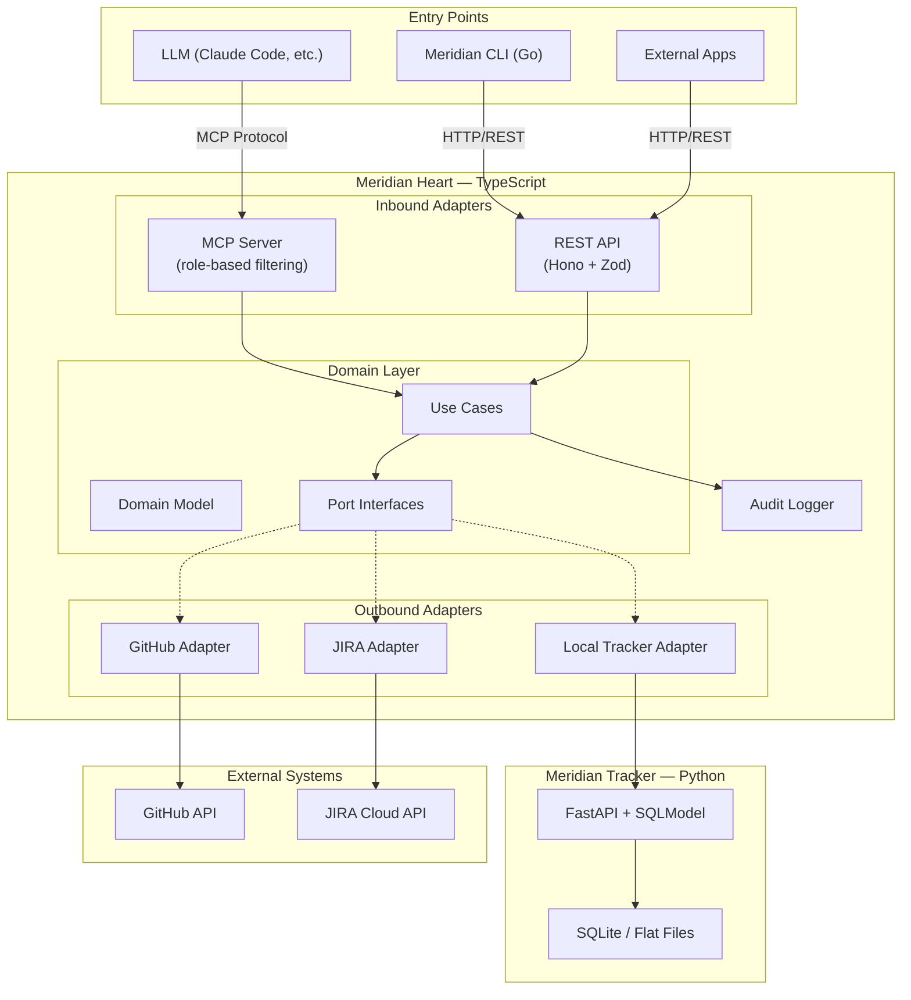

# Implementation Plan: Meridian

## Executive Summary

Meridian is an enterprise-ready project management standardization tool that provides a unified interface for interacting with any issue tracking system (GitHub Issues, JIRA, local tracker, and more) through MCP (Model Context Protocol) and REST API. The system uses a "Lean Heart" architecture — a TypeScript core service with hexagonal architecture that holds all adapter logic and exposes both MCP (for LLMs) and REST (for CLI and external apps) protocols. A Go CLI and a Python lightweight tracker round out the polyglot system, with each component using the best-fit language while the heart ensures adapters are never duplicated. Licensed under MIT.

## Requirements

### Functional Requirements
- Unified interface (ports) to read/write issues, epics, tasks, comments, and metadata across multiple issue tracking backends
- Pluggable backend adapters for GitHub Issues, JIRA, and a local lightweight tracker
- Role-based MCP tool exposure: PM tools (create-epic, view-roadmap, assign-priority), Dev tools (pick-next-task, update-status, view-context), extensible to more roles
- Developer-focused Go CLI for project overview, task management, and fast workflows with Claude Code
- Standalone lightweight issue tracker with SQLite/flat file storage and REST API
- Audit logging of all operations for compliance and traceability

### Non-Functional Requirements
- Clean architecture (hexagonal / ports & adapters) with dependencies pointing inward
- Developer friendliness: clear APIs, good documentation, easy local setup
- Decoupled systems: MCP, CLI, and tracker are independent, connected through the heart's unified interface
- Scalable from solo developer to large organization
- Enterprise compliance: audit trails, auth delegation, structured logging
- Extensible: new backends, new role profiles, new tools addable without modifying core domain logic

### MVP Scope

**In Scope (v1):**
- Core domain model + generalized interface (port interfaces)
- GitHub Issues backend adapter
- MCP server (v1 SDK) with PM + Dev role profiles
- Go CLI with project overview and task management
- Lightweight tracker with SQLite/flat file storage and REST API
- Audit logging foundation
- Developer documentation

**Deferred (v2+):**
- JIRA backend adapter
- Multi-backend simultaneous support
- Tracker web UI
- Additional role profiles (QA, Designer, Stakeholder)
- Cross-backend issue migration/sync
- Plugin system for third-party adapters
- MCP Gateway for multi-tenant enterprise deployment
- Caching/offline capability
- Webhook/event system

## Architecture

### Overview

The **"Lean Heart"** architecture places a TypeScript core service at the center. This heart contains:
- **Domain layer:** Pure TypeScript domain model, use cases, and port interfaces
- **Inbound adapters:** MCP server (for LLMs) and REST API (for CLI and external apps)
- **Outbound adapters:** GitHub adapter (Octokit), JIRA adapter (jira.js), Local Tracker adapter (HTTP client)
- **Infrastructure:** Audit logger, config manager, auth delegation

The Go CLI and Python tracker are fully independent systems that communicate with the heart via HTTP/REST. The tracker is also a standalone product — it works without the heart.

**Selected over alternatives:**
- *Gateway Heart (plugin system):* Deferred — plugin system adds complexity without MVP benefit. Port interfaces already define the future plugin contract.
- *Resilient Heart (caching/offline):* Deferred — caching layer can be added as a decorator around port interfaces without restructuring.

### Component Diagram



### Data Flow

**LLM creates an issue:** LLM → MCP tool call → Meridian Heart MCP Server (role check) → Use Case (validate) → Port Interface → Active Adapter (e.g., GitHub) → External API → Response mapped to domain model → MCP response → LLM

**Developer views overview:** `meridian overview` → HTTP GET → Heart REST API (Zod validation) → Use Case (aggregate) → Port Interface → Adapter → External API → Domain object → JSON response → CLI renders TUI

**Heart connects to Meridian Tracker:** Any consumer → Heart (as above) → Local Tracker Adapter → HTTP to Tracker's FastAPI → Tracker processes independently → Response → Adapter maps to unified model → Consumer receives

### Key Design Decisions

| Decision | Rationale | Alternative Rejected |
|---|---|---|
| Single heart with dual protocol (MCP + REST) | Both protocols share domain layer, no logic duplication | Separate MCP and REST services |
| Adapters as static monorepo modules | Type-safe, debuggable, compile-time checks | Dynamic plugin loading (deferred to v2+) |
| Role-based MCP filtering via tags | Proven pattern (Xweather), keeps LLM context focused | Multiple MCP server instances |
| CLI uses REST API (not MCP) | REST is simpler for programmatic clients, MCP is for LLMs | CLI as MCP client |
| Tracker fully independent | Works standalone, clean decoupling | Tracker as library inside heart |
| OpenAPI spec generated from code | No spec drift, API always matches implementation | Spec-first design |

## Tech Stack

### Heart Service (TypeScript)

| Layer | Choice | Version | Rationale |
|-------|--------|---------|-----------|
| Runtime | Node.js LTS | 22.x | Production stability, widest MCP SDK compatibility |
| Package Manager | pnpm | 9.x | Fast, efficient disk usage, excellent workspaces |
| Monorepo | Turborepo | 2.x | Simple build orchestration and caching |
| REST Framework | Hono | 4.x | Lightweight, native zod-openapi integration |
| Validation | Zod | 4.x | Required by MCP SDK, shared across all layers |
| MCP SDK | @modelcontextprotocol/sdk | v1 (stable) | Official TypeScript SDK |
| OpenAPI | @hono/zod-openapi | latest | Auto-generates spec from routes + schemas |
| GitHub Client | Octokit | latest | Official, TypeScript-native |
| JIRA Client | jira.js | 4.x | TypeScript JIRA Cloud client |
| Logging | Pino | 9.x | Fastest structured JSON logger |
| Testing | Vitest | 3.x | Fast, TypeScript-native |

### CLI (Go)

| Layer | Choice | Version | Rationale |
|-------|--------|---------|-----------|
| CLI Framework | Cobra | latest | Industry standard, subcommands + flags |
| TUI | Bubbletea + Lipgloss | latest | Rich terminal UIs, beautiful styling |
| API Client | oapi-codegen (generated) | latest | Type-safe client from Heart's OpenAPI spec |
| Config | Viper | latest | File + env + flags management |

### Lightweight Tracker (Python)

| Layer | Choice | Version | Rationale |
|-------|--------|---------|-----------|
| Web Framework | FastAPI | 0.115+ | Async, auto OpenAPI docs, Pydantic integration |
| ORM | SQLModel | latest | Combines SQLAlchemy + Pydantic |
| Storage | SQLite + flat files (JSON) | built-in | Zero-config, dual storage options |
| Dependency Mgmt | uv | latest | Fast Python package manager |

### Schema Flow

```
Zod Schema → MCP tool validation
           → REST request/response validation
           → OpenAPI 3.1 spec (auto-generated)
               → Go CLI client (auto-generated via oapi-codegen)
               → API documentation (Swagger UI / Scalar)
```

Define once, propagate everywhere.

## Implementation Roadmap

### Milestone 1: Core Domain & Foundation
**Deliverable:** Domain model, port interfaces, monorepo scaffold, tested with in-memory fakes
**Key Tasks:**
- [ ] Initialize monorepo (pnpm + Turborepo + TypeScript) — S
- [ ] Design domain model entities (Issue, Epic, Project, Comment, User, Status, Priority) — L
- [ ] Define port interfaces (IIssueRepository, IProjectRepository, etc.) — L
- [ ] Implement use cases with in-memory adapters — L
- [ ] Set up Pino audit logger — S
- [ ] Set up CI pipeline — S
**Dependencies:** None
**Top Risk:** Domain model may not map cleanly to all backends → validate against GitHub + JIRA data models before finalizing

### Milestone 2: GitHub Adapter & REST API
**Deliverable:** Heart reads/writes GitHub Issues through REST API
**Key Tasks:**
- [ ] Implement GitHub adapter (Octokit) — L
- [ ] Implement domain ↔ GitHub mappers — M
- [ ] Set up Hono REST API with zod-openapi — M
- [ ] Define REST routes (issues CRUD, project overview) — M
- [ ] Implement composition root and config manager — M
- [ ] Auto-generate OpenAPI spec — S
**Dependencies:** Milestone 1
**Top Risk:** GitHub API rate limiting in tests → use mocks for unit tests, dedicated test repo for integration

### Milestone 3: MCP Server & Role Profiles
**Deliverable:** LLMs interact with GitHub Issues via MCP with PM and Dev role profiles
**Key Tasks:**
- [ ] Set up MCP server with @modelcontextprotocol/sdk v1 — M
- [ ] Define PM role tools (create-epic, view-roadmap, etc.) — L
- [ ] Define Dev role tools (pick-next-task, update-status, etc.) — L
- [ ] Implement tag-based role filtering — M
- [ ] Support stdio + streamable HTTP transports — M
- [ ] Test with Claude Code — M
**Dependencies:** Milestone 2
**Top Risk:** Tool descriptions may confuse LLMs → test with real Claude Code early, iterate on naming

### Milestone 4: Meridian CLI
**Deliverable:** `meridian` CLI for project overview, issue management
**Key Tasks:**
- [ ] Generate Go client from OpenAPI spec (oapi-codegen) — S
- [ ] Implement Cobra commands (overview, issues list/create/update, config) — M
- [ ] Build Bubbletea TUI views — M
- [ ] Cross-compile binaries — S
**Dependencies:** Milestone 2 (REST API)
**Top Risk:** Generated client code may need manual adjustments → wrap in service layer

### Milestone 5: Meridian Tracker
**Deliverable:** Standalone Python tracker + Heart adapter
**Key Tasks:**
- [ ] FastAPI + SQLModel project setup — S
- [ ] Tracker domain model and SQLite storage — M
- [ ] Flat file (JSON) storage backend — M
- [ ] Tracker REST API routes — M
- [ ] Heart adapter (adapter-local package) — M
**Dependencies:** Milestone 1 (can run parallel to M3/M4)
**Top Risk:** Scope creep → keep it CRUD-only, no workflows or notifications

### Milestone 6: Integration, Docs & Polish
**Deliverable:** All components working end-to-end, documentation complete
**Key Tasks:**
- [ ] End-to-end tests (LLM → MCP → Heart → GitHub, CLI → Heart → GitHub, MCP → Heart → Tracker) — M
- [ ] Audit log verification — S
- [ ] Error handling audit — M
- [ ] README, quickstart, architecture docs, adapter development guide — M
- [ ] Release artifacts (Docker, binaries, Python package) — M
**Dependencies:** Milestones 1–5

### Milestone Dependencies

```
M1 → M2 → M3 → M6
          → M4 → M6
M1 → M5 ------→ M6
```

M4 and M5 can run in parallel once their dependencies are met.

## Testing Strategy

| Layer | Scope | Tool | Coverage Target |
|---|---|---|---|
| Unit | Domain model, use cases, mappers | Vitest / go test / pytest | 90%+ domain layer |
| Integration | Adapter ↔ external API | Vitest + MSW mocking | All adapters |
| E2E | Full flow: consumer → heart → backend | Real GitHub test repo | Critical paths |
| MCP Protocol | MCP client → tool calls | MCP SDK test client | All tools + role filtering |
| CLI | Command output verification | Go testing + golden files | All commands |

## CI/CD & Deployment

### Pipeline: Lint → Unit Tests → Integration Tests → Release (on tag)

### Artifacts

| Component | Format | Distribution |
|---|---|---|
| Heart | Docker image | GitHub Container Registry |
| CLI | Cross-platform binaries | GitHub Releases (goreleaser) |
| Tracker | Python package | PyPI / GitHub Releases |

### Environment Config

Heart is configured via environment variables: `MERIDIAN_ADAPTER` (github/local/jira), backend credentials, port numbers, transport mode, log level.

## Success Metrics

1. **MCP Integration Works:** Claude Code can connect, see role-filtered tools, and create/list/update issues on GitHub through natural conversation
2. **CLI Adoption:** Own team uses `meridian` daily for project overview and task management
3. **Adapter Abstraction Holds:** Switching from GitHub to Meridian Tracker adapter requires only a config change — no code changes in MCP tools, CLI, or use cases
4. **New Adapter < 1 Day:** A developer familiar with the codebase can implement a new backend adapter in under one working day
5. **Developer Onboarding < 30 min:** A new developer can clone, build, run tests, and connect Claude Code to the MCP server within 30 minutes using the documentation

## Open Questions

1. **MCP SDK v2 Migration:** TypeScript MCP SDK v2 is expected Q1 2026. Starting with v1 (stable). Plan migration when v2 stabilizes.
2. **JIRA Adapter Timing:** When to start the JIRA adapter? After v1 launch, or as an immediate follow-up? Depends on enterprise adoption demand.
3. **Tracker Growth Path:** How far should the Meridian Tracker grow? At what point does it need its own auth, permissions, and multi-user support? Define the boundary before v2.
4. **MCP Transport Default:** MCP server will support both stdio (local Claude Code) and streamable HTTP (shared/remote). stdio as default for dev use.
5. **GitHub Organization:** Reserve `meridian-pm` on GitHub for the project and npm scope `@meridian-pm`.

## Sources

### Phase 1: Discovery
1. [Project Management MCP Servers — Merge.dev](https://www.merge.dev/blog/project-management-mcp-servers)
2. [MCP Best Practices Guide](https://modelcontextprotocol.info/docs/best-practices/)
3. [MCP Tool Filtering — Xweather](https://www.xweather.com/docs/mcp-server/filtering-tool-scoping)
4. [Apideck Unified Issue Tracking API](https://www.apideck.com/issue-tracking-api)
5. [git-bug: Distributed Bug Tracker](https://github.com/git-bug/git-bug)
6. [MCP Specification v2025-11-25](https://modelcontextprotocol.io/specification/2025-11-25)

### Phase 2: Architecture
7. [MCP TypeScript SDK](https://github.com/modelcontextprotocol/typescript-sdk)
8. [MCP Go SDK](https://github.com/modelcontextprotocol/go-sdk)
9. [MCP Gateway — acehoss](https://github.com/acehoss/mcp-gateway)
10. [Hexagonal Architecture with TypeScript](https://betterprogramming.pub/how-to-ports-and-adapter-with-typescript-32a50a0fc9eb)
11. [API Gateway Pattern — Microservices.io](https://microservices.io/patterns/apigateway.html)

### Phase 3: Tech Stack
12. [Hono Zod OpenAPI](https://hono.dev/examples/zod-openapi)
13. [Hono vs Fastify — Better Stack](https://betterstack.com/community/guides/scaling-nodejs/hono-vs-fastify/)
14. [Turborepo Monorepo Insights](https://medium.com/ekino-france/monorepo-insights-nx-turborepo-and-pnpm-3-4-751384b5a6db)
15. [Bun vs Node.js 2025 — Strapi](https://strapi.io/blog/bun-vs-nodejs-performance-comparison-guide)
16. [Pino vs Winston — Better Stack](https://betterstack.com/community/comparisons/pino-vs-winston/)
17. [oapi-codegen](https://github.com/oapi-codegen/oapi-codegen)
18. [SQLModel — FastAPI](https://sqlmodel.tiangolo.com/tutorial/fastapi/)
19. [Cobra CLI](https://github.com/spf13/cobra)
20. [FastMCP 3.0](https://www.jlowin.dev/blog/fastmcp-3)
