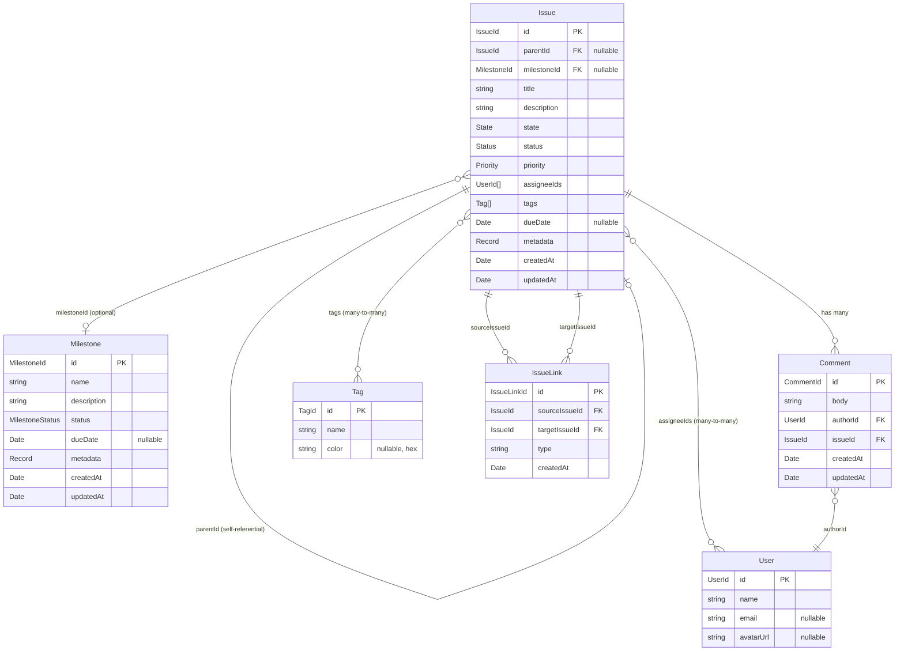

# Domain Model

## 1. Purpose & Scope

This document defines the **target domain model** for Meridian — the set of entities, relationships, and constraints that all implementations (Heart, Tracker, CLI, adapters) must conform to. Where the target model diverges from the current implementation, changes are tracked in [DOMAIN_MODEL_MIGRATION.md](./DOMAIN_MODEL_MIGRATION.md). The current implementation remains valid until migration is complete; this document describes where the model is heading, not only where it is today.

## 2. Model Overview

**Issue** is the core work unit. Issues form a 3-level hierarchy via parent/child relationships: Epic (L1) → Story (L2) → Subtask (L3). Beyond hierarchy, issues can be connected through **IssueLinks** — typed relationships such as "blocks", "duplicates", or "relates to" — that express dependencies and associations between any two issues. Every issue can optionally belong to a **Milestone** — a goal-oriented target with a due date and open/closed state. Issues carry two orthogonal progress fields: **State** is a fixed lifecycle enum (`open`, `in_progress`, `done`) used for cross-backend mapping; **Status** is a project-configurable workflow step (`backlog`, `ready`, `in_progress`, `in_review`, `done` by default) that captures finer-grained progress. **Priority** is validated against a configurable set (global defaults until the Project entity lands). **Tags** are free-form labels that will become project-scoped when Project arrives. **Comments** are threaded on individual issues. **Users** are read-only identities resolved from external systems.

## 3. Entity Relationship Diagram

## 4. Entity Definitions

### Issue

The core work unit. Issues represent tasks, stories, bugs, epics, or any other trackable item. Hierarchy is expressed through `parentId` — an issue with children is an epic (L1), a child with children of its own is a story (L2), and a leaf at depth 3 is a subtask (L3).

| Field | Type | Required | Default | Constraints | Description |
|---|---|---|---|---|---|
| `id` | `IssueId` (branded UUID) | yes | generated | UUID v4 | Unique identifier |
| `parentId` | `IssueId \| null` | no | `null` | Must reference existing issue; max depth 3; no cycles | Parent issue for hierarchy |
| `milestoneId` | `MilestoneId \| null` | no | `null` | Must reference existing milestone if set | Optional milestone grouping |
| `title` | `string` | yes | — | 1–500 chars | Short summary |
| `description` | `string` | no | `""` | — | Detailed description (Markdown) |
| `state` | `State` | no | `"open"` | One of `open`, `in_progress`, `done` | Lifecycle state (fixed enum) |
| `status` | `Status` | no | `"backlog"` | Must be in configured status set | Workflow step (project-configurable) |
| `priority` | `Priority` | no | `"normal"` | Must be in configured priority set | Urgency level |
| `assigneeIds` | `UserId[]` | no | `[]` | Each must reference a valid user | Assigned users |
| `tags` | `Tag[]` | no | `[]` | — | Categorization labels |
| `dueDate` | `Date \| null` | no | `null` | — | Target completion date |
| `metadata` | `Record<string, unknown>` | no | `{}` | — | Adapter-specific data (GitHub number, JIRA key, etc.) |
| `createdAt` | `Date` | yes | generated | — | Creation timestamp |
| `updatedAt` | `Date` | yes | generated | Updated on every mutation | Last modification timestamp |

**Relationships:**
- **Parent** — `parentId` → `Issue` (optional, self-referential)
- **Milestone** — `milestoneId` → `Milestone` (optional)
- **Comments** — one-to-many via `Comment.issueId`
- **Assignees** — many-to-many via `assigneeIds` array
- **Tags** — many-to-many via embedded `tags` array
- **Outgoing links** — one-to-many via `IssueLink.sourceIssueId`
- **Incoming links** — one-to-many via `IssueLink.targetIssueId`

### Milestone

A goal-oriented target that groups related issues toward a deadline. Milestones are optional — issues can exist without one.

| Field | Type | Required | Default | Constraints | Description |
|---|---|---|---|---|---|
| `id` | `MilestoneId` (branded UUID) | yes | generated | UUID v4 | Unique identifier |
| `name` | `string` | yes | — | 1–200 chars | Display name |
| `description` | `string` | no | `""` | — | Purpose and scope (Markdown) |
| `status` | `"open" \| "closed"` | no | `"open"` | — | Whether the milestone is active or completed |
| `dueDate` | `Date \| null` | no | `null` | — | Target completion date |
| `metadata` | `Record<string, unknown>` | no | `{}` | — | Adapter-specific data |
| `createdAt` | `Date` | yes | generated | — | Creation timestamp |
| `updatedAt` | `Date` | yes | generated | Updated on every mutation | Last modification timestamp |

**Relationships:**
- **Issues** — one-to-many via `Issue.milestoneId` (reverse lookup)

### Comment

A text note attached to an issue. Comments are immutable in authorship — only the body can be edited.

| Field | Type | Required | Default | Constraints | Description |
|---|---|---|---|---|---|
| `id` | `CommentId` (branded UUID) | yes | generated | UUID v4 | Unique identifier |
| `body` | `string` | yes | — | min 1 char | Comment content (Markdown) |
| `authorId` | `UserId` | yes | — | Must reference a valid user | Who wrote the comment |
| `issueId` | `IssueId` | yes | — | Must reference an existing issue | Which issue this belongs to |
| `createdAt` | `Date` | yes | generated | — | Creation timestamp |
| `updatedAt` | `Date` | yes | generated | Updated on body edit | Last modification timestamp |

**Relationships:**
- **Issue** — many-to-one via `issueId`
- **Author** — many-to-one via `authorId` → `User`

### User

A read-only identity resolved from external systems (GitHub login, JIRA account, etc.). Meridian does not manage users — it imports them from adapters.

| Field | Type | Required | Default | Constraints | Description |
|---|---|---|---|---|---|
| `id` | `UserId` (branded UUID) | yes | generated | UUID v4 | Unique identifier |
| `name` | `string` | yes | — | 1–200 chars | Display name |
| `email` | `string \| null` | no | `null` | Valid email format if set | Contact email |
| `avatarUrl` | `string \| null` | no | `null` | Valid URL if set | Profile image |

**Relationships:**
- **Issues** — many-to-many via `Issue.assigneeIds`
- **Comments** — one-to-many via `Comment.authorId`

### Tag

A categorization label applied to issues. Tags are structurally simple — scoping rules will be added when the Project entity lands.

| Field | Type | Required | Default | Constraints | Description |
|---|---|---|---|---|---|
| `id` | `TagId` (branded UUID) | yes | generated | UUID v4 | Unique identifier |
| `name` | `string` | yes | — | 1–100 chars | Display name |
| `color` | `string \| null` | no | `null` | Hex format `#rrggbb` if set | Display color |

**Relationships:**
- **Issues** — many-to-many via `Issue.tags`

### IssueLink

A join entity connecting two issues with a typed relationship. Each link is stored once (not duplicated for both directions). For symmetric relationship types, only one direction is stored (`sourceIssueId < targetIssueId` by UUID sort); queries return both perspectives.

| Field | Type | Required | Default | Constraints | Description |
|---|---|---|---|---|---|
| `id` | `IssueLinkId` (branded UUID) | yes | generated | UUID v4 | Unique identifier |
| `sourceIssueId` | `IssueId` | yes | — | Must reference an existing issue | Issue on the "forward" side of the relationship |
| `targetIssueId` | `IssueId` | yes | — | Must reference an existing issue | Issue on the "inverse" side of the relationship |
| `type` | `string` | yes | — | Must be in configured relationship type set | Relationship type name (e.g. `"blocks"`, `"duplicates"`, `"relates to"`) |
| `createdAt` | `Date` | yes | generated | — | Creation timestamp |

**Constraints:**
- **No self-links** — `sourceIssueId !== targetIssueId`
- **No duplicates** — unique on `sourceIssueId + targetIssueId + type`
- **Symmetric normalization** — for symmetric types (e.g. `"relates to"`), the link is stored with `sourceIssueId < targetIssueId` by UUID sort order

**Relationships:**
- **Source issue** — many-to-one via `sourceIssueId` → `Issue`
- **Target issue** — many-to-one via `targetIssueId` → `Issue`

## 5. State, Status & Priority

### State

A **fixed** lifecycle enum. Every issue has exactly one state. State never changes shape — it is the same across all projects, all adapters, and all backends. It exists so that external systems with wildly different workflows (JIRA's 8 custom statuses, GitHub's binary open/closed) can always be mapped to a common set of buckets.

| Value | Semantics |
|---|---|
| `open` | Not started or not yet actively worked on |
| `in_progress` | Actively being worked on |
| `done` | Completed, resolved, or closed |

State is **not** project-configurable. It is an enum: `"open" | "in_progress" | "done"`.

### Status

A **project-configurable** workflow step. Each status maps to exactly one state (its category), enabling cross-backend mapping. Status captures finer-grained progress that varies by team workflow.

**Schema:** `{ name: string, state: State, color?: string }`

**Default set** (ships with every project until Project configuration lands):

| Name | State | Description |
|---|---|---|
| `backlog` | `open` | Captured but not yet prioritized |
| `ready` | `open` | Prioritized and ready to be picked up |
| `in_progress` | `in_progress` | Actively being worked on |
| `in_review` | `in_progress` | Work complete, awaiting review |
| `done` | `done` | Completed and accepted |

When Project lands, each project defines its own status list. The default set above is the starting configuration.

### Priority

**Target model:** A project-defined ordered list of `{ name: string, ordinal: number, color?: string }`. The ordinal determines sort order. Custom priority levels can be added per project.

**Interim (current):** A fixed global enum validated by Zod:

| Name | Ordinal | Description |
|---|---|---|
| `low` | 0 | Nice to have |
| `normal` | 1 | Standard work (default) |
| `high` | 2 | Important, needs attention soon |
| `urgent` | 3 | Blocking, needs immediate attention |

The default set ships with any new project when Project configuration lands.

### Relationship Type

A **project-configurable** set of relationship types that govern how issues can be linked. Each type defines a forward label, an inverse label, and whether the relationship is directed or symmetric. Like Status and Priority, the set will become per-project when the Project entity lands.

**Schema:** `{ name: string, inverse: string, directionality: "directed" | "symmetric" }`

**Default set:**

| Name | Inverse | Directionality | Semantics |
|---|---|---|---|
| `blocks` | `is blocked by` | directed | Target cannot proceed until source is resolved |
| `duplicates` | `is duplicated by` | directed | Source is a duplicate of target |
| `relates to` | `relates to` | symmetric | General association, no ordering semantics |

- **Directed** types have distinct forward/inverse labels. The source issue sees the forward label; the target issue sees the inverse label.
- **Symmetric** types have identical forward and inverse labels. Both issues see the same label regardless of storage order.

Custom relationship types can be added per project when Project configuration lands. The default set above is the starting configuration.

## 6. Issue Hierarchy

Issues form a tree via `parentId`, limited to 3 levels of depth:

| Depth | Convention | Example |
|---|---|---|
| L1 (root) | Epic | "User Authentication" |
| L2 | Story | "Implement OAuth flow" |
| L3 (leaf) | Subtask | "Add token refresh logic" |

### Rules

1. **Max depth = 3.** An issue at depth 3 cannot have children.
2. **Depth is computed** from the parent chain, not stored.
3. **Circular references are rejected.** Setting `parentId` validates that the target is not a descendant of the issue being modified.
4. **Validation occurs in the use-case layer**, not at the schema level. The schema allows any valid `IssueId` as `parentId`; business rules enforce depth and acyclicity.
5. **`metadata.type`** (`"epic"`, `"story"`, `"subtask"`) is a labeling convention. It is not authoritative — hierarchy depth is the source of truth.
6. **Reparenting** is allowed. Moving an issue to a new parent re-validates depth for the entire subtree.
7. **Orphaning** is allowed. Setting `parentId` to `null` makes an issue a root (L1) node.
8. **Deleting a parent** does not cascade. Child issues are orphaned (their `parentId` is set to `null`).

### Querying

- `GET /issues?parentId={id}` — list direct children
- `GET /issues?parentId=null` — list root issues (no parent)
- Issue responses include `childCount` (computed, not stored) to indicate whether an issue has children without requiring a separate query

## 7. Issue Links

Issue links express typed relationships between any two issues, independent of hierarchy. While `parentId` models structural containment (Epic → Story → Subtask), issue links model cross-cutting concerns: blocking dependencies, duplicate tracking, and general associations.

### Rules

1. **No self-links.** An issue cannot link to itself.
2. **No duplicate links.** A pair of issues can have at most one link of each type. Uniqueness is enforced on `sourceIssueId + targetIssueId + type`.
3. **Symmetric normalization.** For symmetric relationship types (e.g. `"relates to"`), the link is always stored with `sourceIssueId < targetIssueId` by UUID sort order. This prevents logical duplicates (A→B and B→A being stored separately).
4. **Directed semantics.** For directed types (e.g. `"blocks"`), the source issue carries the forward label ("blocks") and the target issue carries the inverse label ("is blocked by"). Storage order is meaningful.
5. **Validation occurs in the use-case layer.** The schema allows any valid `IssueId` pair; business rules enforce self-link prevention, duplicate detection, and type validation.
6. **Deleting an issue orphans its links.** When an issue is deleted, all links where it appears as source or target are also deleted (cascade delete).
7. **Links are independent of hierarchy.** An issue can link to any other issue regardless of their position in the parent/child tree. A subtask can block an epic; an epic can relate to another epic.

### Relationship to Hierarchy

Issue links and `parentId` serve different purposes:

| Aspect | Hierarchy (`parentId`) | Links (`IssueLink`) |
|---|---|---|
| Cardinality | One parent per issue | Many links per issue |
| Depth limit | Max 3 levels | No depth concept |
| Semantics | Structural containment | Typed association |
| Direction | Always parent → child | Directed or symmetric |
| Examples | Epic → Story → Subtask | "blocks", "duplicates", "relates to" |

### Querying

- `GET /issues/:id/links` — list all links for an issue (both directions). Returns the link with the appropriate label (forward or inverse) based on perspective.
- `POST /issues/:id/links` — create a link from this issue to another
- `DELETE /issue-links/:id` — remove a link by its ID

Link responses include the relationship type name and the resolved label for the querying issue's perspective (forward label if source, inverse label if target).

## 8. External System Mapping

### Issue

| Domain Field | GitHub Issues | JIRA | Local Tracker |
|---|---|---|---|
| `id` | Deterministic UUID from `owner/repo#number` | Deterministic UUID from JIRA key | Database-generated UUID |
| `parentId` | HTML comment in body: `<!-- meridian:parent=ISSUE_URL -->` | Native Epic Link / Subtask relation | Foreign key column |
| `milestoneId` | GitHub Milestone (via `config.milestoneId`) | JIRA Fix Version | Foreign key column |
| `title` | `title` | `summary` | `title` column |
| `description` | `body` | `description` | `description` column |
| `state` | `state` (open/closed) + `status:in-progress` label → 3-way mapping | Status field → state category mapping | `state` column |
| `status` | `status:{name}` label (e.g. `status:in-review`) | Status field name directly | `status` column |
| `priority` | `priority:{level}` label | Priority field | `priority` column |
| `assigneeIds` | `assignees[].login` → deterministic UUID | `assignee` field | Junction table |
| `tags` | Labels (excluding `priority:*` and `status:*` prefixes) | Labels / Components | Junction table |
| `dueDate` | Not mapped (null) | `duedate` field | `due_date` column |
| `metadata` | `github_number`, `github_url`, `github_reactions`, `github_locked`, `github_milestone` | `jira_key`, `jira_url`, `jira_type` | — |

### Milestone

| Domain Field | GitHub Issues | JIRA | Local Tracker |
|---|---|---|---|
| `id` | Deterministic UUID from `owner/repo#milestone_number` | Deterministic UUID from Fix Version | Database-generated UUID |
| `name` | `title` | Fix Version `name` | `name` column |
| `description` | `description` | Fix Version `description` | `description` column |
| `status` | `state` (open/closed) via `github_state` metadata | Fix Version `released` flag | `status` column |
| `dueDate` | `due_on` field | Fix Version `releaseDate` | `due_date` column |
| `metadata` | `github_milestone_number`, `github_url`, `github_state`, `github_open_issues`, `github_closed_issues` | `jira_version_id`, `jira_url` | — |

### IssueLink

| Domain Field | GitHub Issues | JIRA | Local Tracker |
|---|---|---|---|
| `id` | Deterministic UUID from comment content hash | Deterministic UUID from JIRA link ID | Database-generated UUID |
| `sourceIssueId` | Issue containing the HTML comment | Native Issue Link API (`inwardIssue`) | Junction table FK (`source_issue_id`) |
| `targetIssueId` | Parsed from comment target: `<!-- meridian:blocks=owner/repo#N -->` | Native Issue Link API (`outwardIssue`) | Junction table FK (`target_issue_id`) |
| `type` | Comment prefix (`blocks`, `duplicates`, `relates-to`) | Link type name mapping (e.g. "Blocks" → `blocks`) | `type` column |
| `createdAt` | Comment creation date or issue updated timestamp | Link creation timestamp | `created_at` column |

**GitHub encoding:** Each link type is encoded as an HTML comment in the source issue's body:
- `<!-- meridian:blocks=owner/repo#N -->` — source blocks target
- `<!-- meridian:duplicates=owner/repo#N -->` — source duplicates target
- `<!-- meridian:relates-to=owner/repo#N -->` — source relates to target

Multiple links are stored as separate comments. On read, the adapter parses all `<!-- meridian:* -->` comments to reconstruct links.

### State Mapping

| Domain State | GitHub | JIRA (example) |
|---|---|---|
| `open` | `state: "open"`, no `status:in-progress` label | Any status in "To Do" category |
| `in_progress` | `state: "open"` + `status:in-progress` label | Any status in "In Progress" category |
| `done` | `state: "closed"` | Any status in "Done" category |

### Status Mapping

| Domain Status (default) | State | GitHub | JIRA (example) |
|---|---|---|---|
| `backlog` | `open` | `state: "open"`, no status label | "Backlog", "Open" |
| `ready` | `open` | `state: "open"` + `status:ready` label | "To Do", "Selected for Development" |
| `in_progress` | `in_progress` | `state: "open"` + `status:in-progress` label | "In Progress", "In Development" |
| `in_review` | `in_progress` | `state: "open"` + `status:in-review` label | "In Review", "In QA" |
| `done` | `done` | `state: "closed"` | "Done", "Closed", "Resolved" |

### Priority Mapping

| Domain Priority | GitHub | JIRA |
|---|---|---|
| `low` | `priority:low` label | "Low", "Lowest" |
| `normal` | No label (default) | "Medium" |
| `high` | `priority:high` label | "High" |
| `urgent` | `priority:urgent` label | "Highest", "Critical" |

## 9. Deferred Concepts

### Project

Groups one or more repositories into a single workspace. Owns the configuration for status workflows, priority levels, and tag scoping. Until Project lands:
- Status uses the global default set defined in section 5 (`backlog`, `ready`, `in_progress`, `in_review`, `done`)
- State is always the fixed enum — Project does not change it
- Priority uses the global fixed set defined in section 5
- Tags are not scoped — all tags are globally visible
- Each adapter instance maps to a single repository

### Sprint / Iteration

Time-boxed work periods. Not currently planned. Could be added as a Milestone variant or as a separate entity that references issues.
