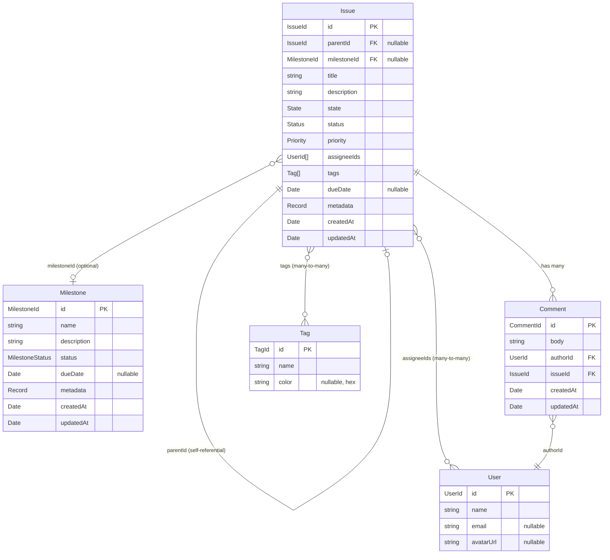

# Domain Model

## 1. Purpose & Scope

This document defines the **target domain model** for Meridian — the set of entities, relationships, and constraints that all implementations (Heart, Tracker, CLI, adapters) must conform to. Where the target model diverges from the current implementation, changes are tracked in [DOMAIN_MODEL_MIGRATION.md](./DOMAIN_MODEL_MIGRATION.md). The current implementation remains valid until migration is complete; this document describes where the model is heading, not only where it is today.

## 2. Model Overview

**Issue** is the core work unit. Issues form a 3-level hierarchy via parent/child relationships: Epic (L1) → Story (L2) → Subtask (L3). Every issue can optionally belong to a **Milestone** — a goal-oriented target with a due date and open/closed state. Issues carry two orthogonal progress fields: **State** is a fixed lifecycle enum (`open`, `in_progress`, `done`) used for cross-backend mapping; **Status** is a project-configurable workflow step (`backlog`, `ready`, `in_progress`, `in_review`, `done` by default) that captures finer-grained progress. **Priority** is validated against a configurable set (global defaults until the Project entity lands). **Tags** are free-form labels that will become project-scoped when Project arrives. **Comments** are threaded on individual issues. **Users** are read-only identities resolved from external systems.

## 3. Entity Relationship Diagram

## 4. Entity Definitions

### Issue

The core work unit. Issues represent tasks, stories, bugs, epics, or any other trackable item. Hierarchy is expressed through `parentId` — an issue with children is an epic (L1), a child with children of its own is a story (L2), and a leaf at depth 3 is a subtask (L3).

| Field | Type | Required | Default | Constraints | Description |
|---|---|---|---|---|---|
| `id` | `IssueId` (branded UUID) | yes | generated | UUID v4 | Unique identifier |
| `parentId` | `IssueId \| null` | no | `null` | Must reference existing issue; max depth 3; no cycles | Parent issue for hierarchy |
| `milestoneId` | `MilestoneId \| null` | no | `null` | Must reference existing milestone if set | Optional milestone grouping |
| `title` | `string` | yes | — | 1–500 chars | Short summary |
| `description` | `string` | no | `""` | — | Detailed description (Markdown) |
| `state` | `State` | no | `"open"` | One of `open`, `in_progress`, `done` | Lifecycle state (fixed enum) |
| `status` | `Status` | no | `"backlog"` | Must be in configured status set | Workflow step (project-configurable) |
| `priority` | `Priority` | no | `"normal"` | Must be in configured priority set | Urgency level |
| `assigneeIds` | `UserId[]` | no | `[]` | Each must reference a valid user | Assigned users |
| `tags` | `Tag[]` | no | `[]` | — | Categorization labels |
| `dueDate` | `Date \| null` | no | `null` | — | Target completion date |
| `metadata` | `Record<string, unknown>` | no | `{}` | — | Adapter-specific data (GitHub number, JIRA key, etc.) |
| `createdAt` | `Date` | yes | generated | — | Creation timestamp |
| `updatedAt` | `Date` | yes | generated | Updated on every mutation | Last modification timestamp |

**Relationships:**
- **Parent** — `parentId` → `Issue` (optional, self-referential)
- **Milestone** — `milestoneId` → `Milestone` (optional)
- **Comments** — one-to-many via `Comment.issueId`
- **Assignees** — many-to-many via `assigneeIds` array
- **Tags** — many-to-many via embedded `tags` array

### Milestone

A goal-oriented target that groups related issues toward a deadline. Milestones are optional — issues can exist without one.

| Field | Type | Required | Default | Constraints | Description |
|---|---|---|---|---|---|
| `id` | `MilestoneId` (branded UUID) | yes | generated | UUID v4 | Unique identifier |
| `name` | `string` | yes | — | 1–200 chars | Display name |
| `description` | `string` | no | `""` | — | Purpose and scope (Markdown) |
| `status` | `"open" \| "closed"` | no | `"open"` | — | Whether the milestone is active or completed |
| `dueDate` | `Date \| null` | no | `null` | — | Target completion date |
| `metadata` | `Record<string, unknown>` | no | `{}` | — | Adapter-specific data |
| `createdAt` | `Date` | yes | generated | — | Creation timestamp |
| `updatedAt` | `Date` | yes | generated | Updated on every mutation | Last modification timestamp |

**Relationships:**
- **Issues** — one-to-many via `Issue.milestoneId` (reverse lookup)

### Comment

A text note attached to an issue. Comments are immutable in authorship — only the body can be edited.

| Field | Type | Required | Default | Constraints | Description |
|---|---|---|---|---|---|
| `id` | `CommentId` (branded UUID) | yes | generated | UUID v4 | Unique identifier |
| `body` | `string` | yes | — | min 1 char | Comment content (Markdown) |
| `authorId` | `UserId` | yes | — | Must reference a valid user | Who wrote the comment |
| `issueId` | `IssueId` | yes | — | Must reference an existing issue | Which issue this belongs to |
| `createdAt` | `Date` | yes | generated | — | Creation timestamp |
| `updatedAt` | `Date` | yes | generated | Updated on body edit | Last modification timestamp |

**Relationships:**
- **Issue** — many-to-one via `issueId`
- **Author** — many-to-one via `authorId` → `User`

### User

A read-only identity resolved from external systems (GitHub login, JIRA account, etc.). Meridian does not manage users — it imports them from adapters.

| Field | Type | Required | Default | Constraints | Description |
|---|---|---|---|---|---|
| `id` | `UserId` (branded UUID) | yes | generated | UUID v4 | Unique identifier |
| `name` | `string` | yes | — | 1–200 chars | Display name |
| `email` | `string \| null` | no | `null` | Valid email format if set | Contact email |
| `avatarUrl` | `string \| null` | no | `null` | Valid URL if set | Profile image |

**Relationships:**
- **Issues** — many-to-many via `Issue.assigneeIds`
- **Comments** — one-to-many via `Comment.authorId`

### Tag

A categorization label applied to issues. Tags are structurally simple — scoping rules will be added when the Project entity lands.

| Field | Type | Required | Default | Constraints | Description |
|---|---|---|---|---|---|
| `id` | `TagId` (branded UUID) | yes | generated | UUID v4 | Unique identifier |
| `name` | `string` | yes | — | 1–100 chars | Display name |
| `color` | `string \| null` | no | `null` | Hex format `#rrggbb` if set | Display color |

**Relationships:**
- **Issues** — many-to-many via `Issue.tags`

## 5. State, Status & Priority

### State

A **fixed** lifecycle enum. Every issue has exactly one state. State never changes shape — it is the same across all projects, all adapters, and all backends. It exists so that external systems with wildly different workflows (JIRA's 8 custom statuses, GitHub's binary open/closed) can always be mapped to a common set of buckets.

| Value | Semantics |
|---|---|
| `open` | Not started or not yet actively worked on |
| `in_progress` | Actively being worked on |
| `done` | Completed, resolved, or closed |

State is **not** project-configurable. It is an enum: `"open" | "in_progress" | "done"`.

### Status

A **project-configurable** workflow step. Each status maps to exactly one state (its category), enabling cross-backend mapping. Status captures finer-grained progress that varies by team workflow.

**Schema:** `{ name: string, state: State, color?: string }`

**Default set** (ships with every project until Project configuration lands):

| Name | State | Description |
|---|---|---|
| `backlog` | `open` | Captured but not yet prioritized |
| `ready` | `open` | Prioritized and ready to be picked up |
| `in_progress` | `in_progress` | Actively being worked on |
| `in_review` | `in_progress` | Work complete, awaiting review |
| `done` | `done` | Completed and accepted |

When Project lands, each project defines its own status list. The default set above is the starting configuration.

### Priority

**Target model:** A project-defined ordered list of `{ name: string, ordinal: number, color?: string }`. The ordinal determines sort order. Custom priority levels can be added per project.

**Interim (current):** A fixed global enum validated by Zod:

| Name | Ordinal | Description |
|---|---|---|
| `low` | 0 | Nice to have |
| `normal` | 1 | Standard work (default) |
| `high` | 2 | Important, needs attention soon |
| `urgent` | 3 | Blocking, needs immediate attention |

The default set ships with any new project when Project configuration lands.

## 6. Issue Hierarchy

Issues form a tree via `parentId`, limited to 3 levels of depth:

| Depth | Convention | Example |
|---|---|---|
| L1 (root) | Epic | "User Authentication" |
| L2 | Story | "Implement OAuth flow" |
| L3 (leaf) | Subtask | "Add token refresh logic" |

### Rules

1. **Max depth = 3.** An issue at depth 3 cannot have children.
2. **Depth is computed** from the parent chain, not stored.
3. **Circular references are rejected.** Setting `parentId` validates that the target is not a descendant of the issue being modified.
4. **Validation occurs in the use-case layer**, not at the schema level. The schema allows any valid `IssueId` as `parentId`; business rules enforce depth and acyclicity.
5. **`metadata.type`** (`"epic"`, `"story"`, `"subtask"`) is a labeling convention. It is not authoritative — hierarchy depth is the source of truth.
6. **Reparenting** is allowed. Moving an issue to a new parent re-validates depth for the entire subtree.
7. **Orphaning** is allowed. Setting `parentId` to `null` makes an issue a root (L1) node.
8. **Deleting a parent** does not cascade. Child issues are orphaned (their `parentId` is set to `null`).

### Querying

- `GET /issues?parentId={id}` — list direct children
- `GET /issues?parentId=null` — list root issues (no parent)
- Issue responses include `childCount` (computed, not stored) to indicate whether an issue has children without requiring a separate query

## 7. External System Mapping

### Issue

| Domain Field | GitHub Issues | JIRA | Local Tracker |
|---|---|---|---|
| `id` | Deterministic UUID from `owner/repo#number` | Deterministic UUID from JIRA key | Database-generated UUID |
| `parentId` | HTML comment in body: `<!-- meridian:parent=ISSUE_URL -->` | Native Epic Link / Subtask relation | Foreign key column |
| `milestoneId` | GitHub Milestone (via `config.milestoneId`) | JIRA Fix Version | Foreign key column |
| `title` | `title` | `summary` | `title` column |
| `description` | `body` | `description` | `description` column |
| `state` | `state` (open/closed) + `status:in-progress` label → 3-way mapping | Status field → state category mapping | `state` column |
| `status` | `status:{name}` label (e.g. `status:in-review`) | Status field name directly | `status` column |
| `priority` | `priority:{level}` label | Priority field | `priority` column |
| `assigneeIds` | `assignees[].login` → deterministic UUID | `assignee` field | Junction table |
| `tags` | Labels (excluding `priority:*` and `status:*` prefixes) | Labels / Components | Junction table |
| `dueDate` | Not mapped (null) | `duedate` field | `due_date` column |
| `metadata` | `github_number`, `github_url`, `github_reactions`, `github_locked`, `github_milestone` | `jira_key`, `jira_url`, `jira_type` | — |

### Milestone

| Domain Field | GitHub Issues | JIRA | Local Tracker |
|---|---|---|---|
| `id` | Deterministic UUID from `owner/repo#milestone_number` | Deterministic UUID from Fix Version | Database-generated UUID |
| `name` | `title` | Fix Version `name` | `name` column |
| `description` | `description` | Fix Version `description` | `description` column |
| `status` | `state` (open/closed) via `github_state` metadata | Fix Version `released` flag | `status` column |
| `dueDate` | `due_on` field | Fix Version `releaseDate` | `due_date` column |
| `metadata` | `github_milestone_number`, `github_url`, `github_state`, `github_open_issues`, `github_closed_issues` | `jira_version_id`, `jira_url` | — |

### State Mapping

| Domain State | GitHub | JIRA (example) |
|---|---|---|
| `open` | `state: "open"`, no `status:in-progress` label | Any status in "To Do" category |
| `in_progress` | `state: "open"` + `status:in-progress` label | Any status in "In Progress" category |
| `done` | `state: "closed"` | Any status in "Done" category |

### Status Mapping

| Domain Status (default) | State | GitHub | JIRA (example) |
|---|---|---|---|
| `backlog` | `open` | `state: "open"`, no status label | "Backlog", "Open" |
| `ready` | `open` | `state: "open"` + `status:ready` label | "To Do", "Selected for Development" |
| `in_progress` | `in_progress` | `state: "open"` + `status:in-progress` label | "In Progress", "In Development" |
| `in_review` | `in_progress` | `state: "open"` + `status:in-review` label | "In Review", "In QA" |
| `done` | `done` | `state: "closed"` | "Done", "Closed", "Resolved" |

### Priority Mapping

| Domain Priority | GitHub | JIRA |
|---|---|---|
| `low` | `priority:low` label | "Low", "Lowest" |
| `normal` | No label (default) | "Medium" |
| `high` | `priority:high` label | "High" |
| `urgent` | `priority:urgent` label | "Highest", "Critical" |

## 8. Deferred Concepts

### Project

Groups one or more repositories into a single workspace. Owns the configuration for status workflows, priority levels, and tag scoping. Until Project lands:
- Status uses the global default set defined in section 5 (`backlog`, `ready`, `in_progress`, `in_review`, `done`)
- State is always the fixed enum — Project does not change it
- Priority uses the global fixed set defined in section 5
- Tags are not scoped — all tags are globally visible
- Each adapter instance maps to a single repository

### Sprint / Iteration

Time-boxed work periods. Not currently planned. Could be added as a Milestone variant or as a separate entity that references issues.
